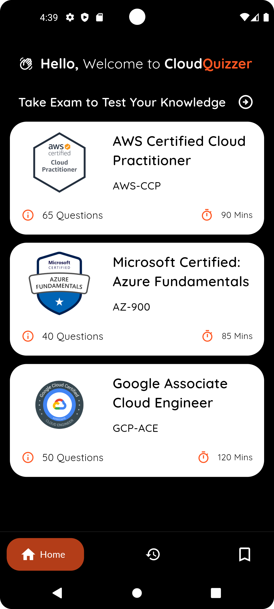
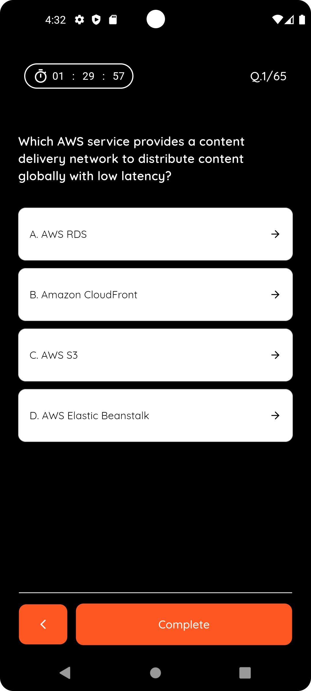
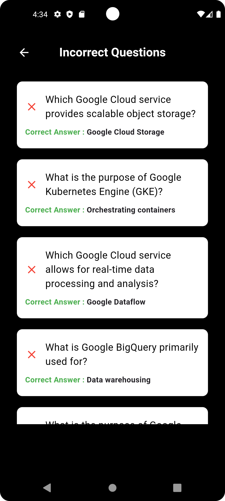

# Cloud Quizzer

**Cloud Quizzer** is a mobile quiz application designed for users preparing for various cloud certifications, such as AWS Cloud Practitioner, Google Cloud Associate, and Microsoft Azure Fundamentals. Built with Flutter, this app provides a smooth, user-friendly experience for reviewing and practicing multiple-choice questions, tracking progress, and improving knowledge of cloud concepts.

---

## Features
- **Multi-Cloud Provider Support**: Includes quizzes for AWS, Google Cloud, and Microsoft Azure certifications.
- **Question Review & Feedback**: Review incorrect answers with explanations.
- **Progress Tracking**: Track scores and improvement across multiple attempts.
- **Certification-Specific Questions**: Organized by certification code for focused learning.
- **Offline Access**: Leverages SQLite for offline quiz access.
  
---

## Screenshots
| Home Screen | Quiz Screen | Review Screen |
|---|---|---|
|  |  |  |
| Home Screen | Quiz Screen | Review Screen |
|---|---|---|
|  |  |  |

---

